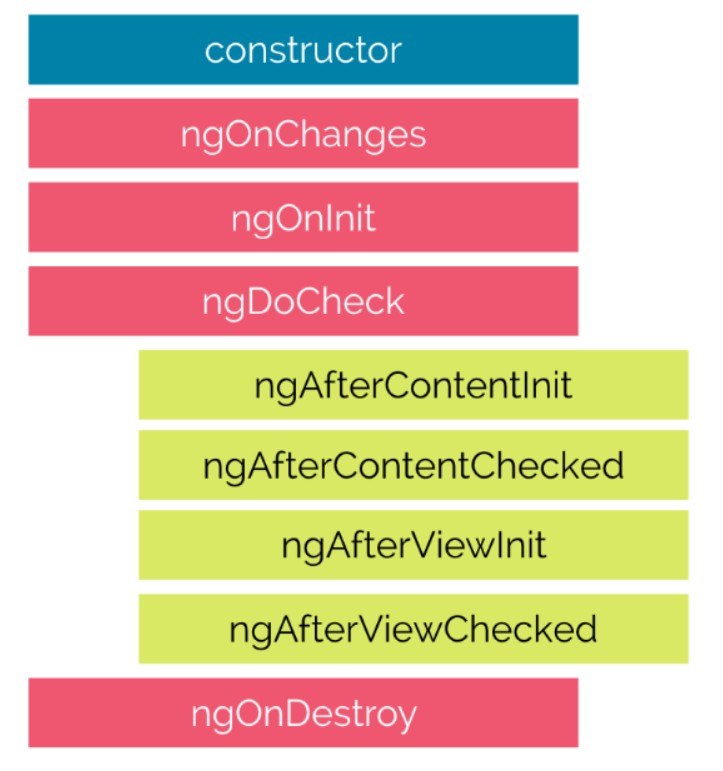
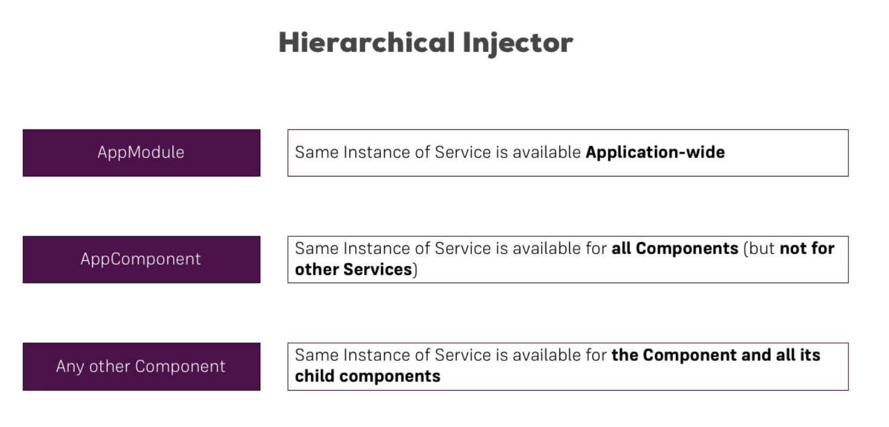
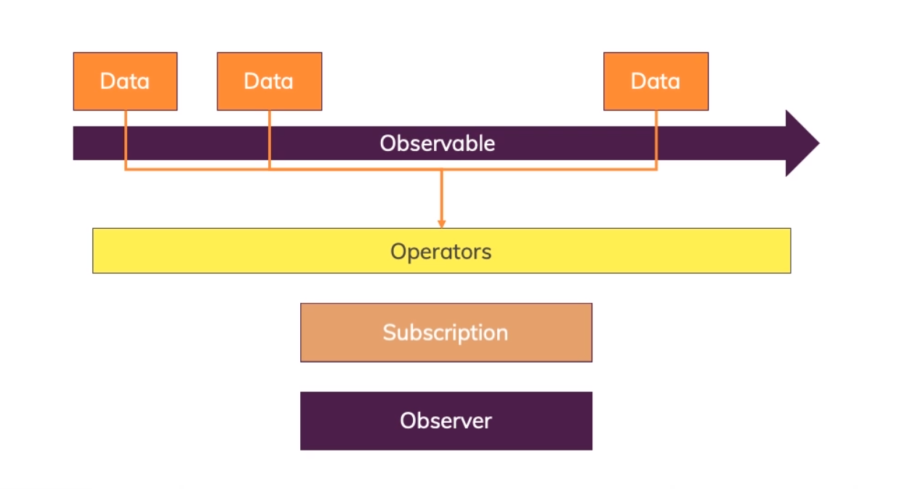

# Angular

lifecycle

| ng...              | description                                                              |
| ------------------ | ------------------------------------------------------------------------ |
| ngOnchanges        | Called after a bound input property changes                              |
| ngOnlnit           | Called once the component is initialized                                 |
| ngDoCheck          | Called during every change detection run                                 |
| ngAfterContentlnit | Called after content (ng-content) has been projected into view           |
| ngAfterViewlnit    | Called after the component's view (and child views) has been initialized |
| ngAfterViewChecked | Called every time the view (and child views) have been checked           |
| ngOnDestroy        | Called once the component is about to be destroyed                       |



create new project Angular

```terminal
ng new <your-name-project> --no-strict --routing false --standalone false
```

Install RxJS

```terminal
yarn add rxjs@<version>

yarn add rxjs
```

create new conponent

```terminal
ng generate component <folder-name>
ng g c <folder-name>
```

create new service

```terminal
ng generate service [name-service]
ng g s [name-service]
```

| Attribute Directives                                                           | Structural Directives                                                     |
| ------------------------------------------------------------------------------ | ------------------------------------------------------------------------- |
| Look like a normal HTML Attribute (possibly with databinding or event binding) | Look like a nomal HTML Attribute but having a leading \* (for desugaring) |
| Only affect/change the element they are added to                               | Affect a whole area in the DOM (elements get added/remove)                |



| @               | Detail                                                                                         |
| --------------- | ---------------------------------------------------------------------------------------------- |
| @Input()        | Used to pass data into a component                                                             |
| @Output()       | used to pass data out of that component                                                        |
| @ViewChild()    | Used to get the parent element of the named element in ViewChild()                             |
| @ContentChild() | Used to pass data inside that named element                                                    |
| @Directive()    | Used when creating a directive, placing it on that element by name in the seletor and using it |
| @Injectable     | Used when importing services to use together                                                   |

## observer

1. next(): This method is called when a new value is emitted from the data stream.
2. error(): This method is called when an error occurs in the data stream.
3. complete(): This method is called when the data stream ends.

example:

```typescript
import { HttpClient } from "@angular/common/http";

@Component({
    selector: "my-app",
    templateUrl: "./app.component.html",
    styleUrls: ["./app.component.css"],
})
export class AppComponent {
    constructor(private http: HttpClient) {}

    ngOnInit() {
        // Tạo một luồng dữ liệu từ yêu cầu HTTP
        const observable = this.http.get("https://example.com/data");

        // Đăng ký một observer để xử lý các giá trị được phát ra từ luồng dữ liệu
        observable.subscribe(
            (data) => {
                // Process new data
            },
            (error) => {
                // Error handling
            },
            () => {
                // The data stream ends
            }
        );
    }
}
```



## rxjs

https://www.learnrxjs.io/learn-rxjs/operators
